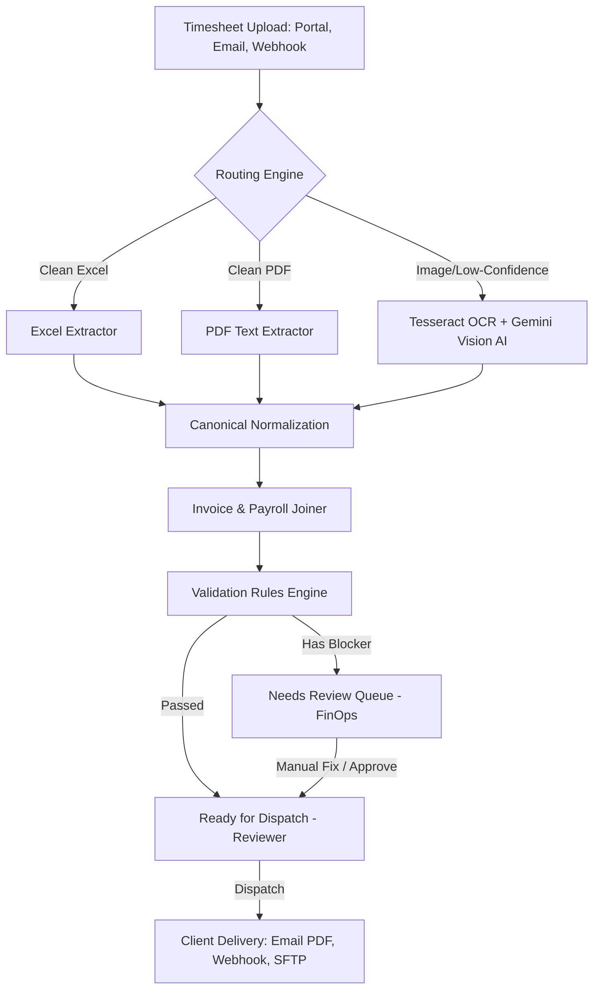

# 🚀 TIA (Timesheet & Invoice Automation)
### Touchless Timesheet-to-Invoice Automation Engine | Built for HackerArena 2.0

[](https://nextjs.org/)
[](https://react.dev/)
[](https://www.typescriptlang.org/)
[](https://www.prisma.io/)
[](https://www.postgresql.org/)
[](https://min.io/)
[](https://ai.google.dev/)
[](https://tailwindcss.com/)

**TIA** is a state-of-the-art automation pipeline that bridges the gap between client-submitted timesheets and finalized invoice dispatches. It eliminates manual data entry, reduces invoicing turnaround from days to minutes, and features a multi-role web portal, real-time validation checks, and automatic fallback to Gemini Vision AI for scanned images and low-confidence documents.

---

## ⚡ Key Features & Workflow



1. **Multi-Channel Ingestion**: Support for timesheet ingestion via web portal uploads, automated Gmail polling (for emails containing timesheets/payroll details), or API webhook endpoints.
2. **Dynamic Routing & Parsing**:
   - **Excel Engine**: Fast parsing of clean xlsx/xls timesheets.
   - **PDF Engine**: Text extraction from digital PDF documents.
   - **OCR & Vision Fallback**: Uses local Tesseract OCR, with automatic escalation to **Gemini 2.5 Flash / Flash Lite** for scanned timesheet images or low-confidence layouts.
3. **Smart Roll-up & Normalization**: Automatically groups and sums duplicate daily or weekly rows to match the contract billing period (monthly, weekly, bi-weekly, or daily).
4. **Billing & Payroll Reconciliation**:
   - Joins extracted rows with system-wide employee rosters and payroll templates.
   - If payroll records are missing, it dynamically derives pay based on the contract or employee's daily rate, standard hours, and overtime multipliers.
   - Computes precise markup rates (e.g. 20% markup, client/employee contracts).
5. **Robust Validation Guardrails**: Runs client-specific and contract-wide validation checks (e.g. Totals Match, Fields Present, Working Days Range, Overtime Caps, Net Worktime Mismatch) before marking invoices as validated.
6. **Multi-Format Dispatch Engine**: Sends validated invoices to clients via customized channels (Email with PDF attachment, JSON Webhook payloads, or remote SFTP exports).

---

## 🛠️ Technology Stack

- **Framework**: Next.js 16 (App Router), React 19, TypeScript
- **Database & ORM**: PostgreSQL, Prisma ORM
- **Object Storage**: MinIO (S3-Compatible store for timesheet files & generated invoices)
- **AI & OCR**: Gemini Developer API (Vision / JSON fallback extraction), Tesseract.js
- **PDF & Canvas**: `pdf-lib`, `pdfjs-dist`, `@napi-rs/canvas` (for PDF rendering & image conversion)
- **Styling & Animations**: Tailwind CSS v4, Motion (fka Framer Motion)
- **Analytics Charts**: Recharts
- **Emails**: Nodemailer

---

## 📂 Folder Architecture

```text
├── agents/             # Extraction agents (Excel, PDF, Tesseract OCR, Gemini Vision API)
├── app/                # Next.js App Router (Separated by role layout & dashboard)
│   ├── (admin)/        # Admin Settings & Auditing portal
│   ├── (client)/       # Client portal for timesheet upload & invoice viewing
│   ├── (finops)/       # FinOps portal for reviewing low-confidence timesheets
│   ├── (reviewer)/     # Reviewer portal for invoice validation & dispatch approval
│   ├── api/            # API endpoints (Jobs, File Storage, Gmail Webhooks)
├── components/         # Reusable UI elements (dashboard, charts, landing, shell)
├── hooks/              # Custom React hooks
├── lib/                # Shared utilities, Prisma clients, email helpers, auth config
├── prisma/             # Schema definitions, seed scripts, & migration records
├── repositories/       # Data Access Object pattern layers for Prisma models
├── samples/            # Generated dummy XLSX, PNG, and PDF files for pipeline testing
├── scripts/            # CLI utilities (generating sample files, database seeding)
├── services/           # Business logic layer (Ingestion, Extraction, Invoice Gen, Validation)
└── types/              # TypeScript typings
```

---

## ⚙️ Development Setup

Follow these steps to run TIA locally.

### 1. Prerequisites
Ensure you have the following installed on your system:
- **Node.js** (v20+ recommended) or **Bun** (recommended runtime)
- **Docker & Docker Compose** (for Postgres and MinIO)

### 2. Clone & Install Dependencies
```bash
git clone <your-repo-url>
cd tia-tasc
bun install
# or
npm install
```

### 3. Spin Up Infrastructure
Start PostgreSQL and MinIO services in the background using Docker Compose:
```bash
docker compose up -d
```
*Note: MinIO web console will be accessible at [http://localhost:9001](http://localhost:9001) (User: `tia`, Pass: `tia12345`).*

### 4. Configure Environment Variables
Copy `.env.example` to `.env` and fill in the values:
```bash
cp .env.example .env
```
Ensure `DATABASE_URL`, `AUTH_SECRET`, and `GEMINI_API_KEY` are configured properly.

### 5. Initialize the Database
Run database migrations and seed the initial client/employee payroll records:
```bash
bunx prisma db push
bunx prisma db seed
```

### 6. Generate Timesheet Sample Files
Create sample timesheet test files (clean XLSX, messy XLSX, scanned PNG, text PDF):
```bash
bun run samples
```

### 7. Run the Demo Pipeline Seed
Optionally run the pipeline simulation script to fill up the dashboards with demo state:
```bash
bun run seed:demo
```

### 8. Run the Development Server
```bash
bun dev
# or
npm run dev
```
Open [http://localhost:3000](http://localhost:3000) to view the portal.

---

## 🔑 Demo Credentials

You can sign in using any of the following accounts:

| Role | Username | Password |
|---|---|---|
| **Admin** | `admin@tia.demo` | `password123` |
| **Financial Operations (FinOps)** | `finops@tia.demo` | `password123` |
| **Invoice Reviewer** | `reviewer@tia.demo` | `password123` |
| **Client Portal** | `client@tia.demo` | `password123` |

---

## 🔍 Code Walkthrough & Entry Points

- **Timesheet Ingestion**: [ingest.service.ts](file:///Users/sharveshsivagnanam/development/tia-tasc/services/ingest.service.ts)
- **Extraction Router & Confidence Gate**: [extraction.service.ts](file:///Users/sharveshsivagnanam/development/tia-tasc/services/extraction.service.ts)
- **Invoice Generation Logic**: [invoice.service.ts](file:///Users/sharveshsivagnanam/development/tia-tasc/services/invoice.service.ts)
- **Rules Engine & Validation**: [validation.service.ts](file:///Users/sharveshsivagnanam/development/tia-tasc/services/validation.service.ts)
- **Automated Email Polling**: [gmail.service.ts](file:///Users/sharveshsivagnanam/development/tia-tasc/services/gmail.service.ts)
- **Gemini Vision Extraction Agent**: [gpt.fallback.ts](file:///Users/sharveshsivagnanam/development/tia-tasc/agents/gpt.fallback.ts)
